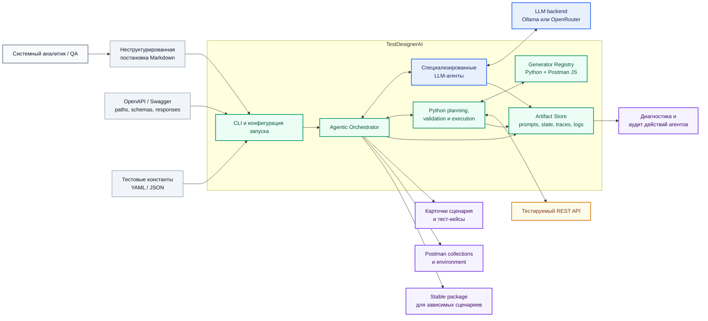
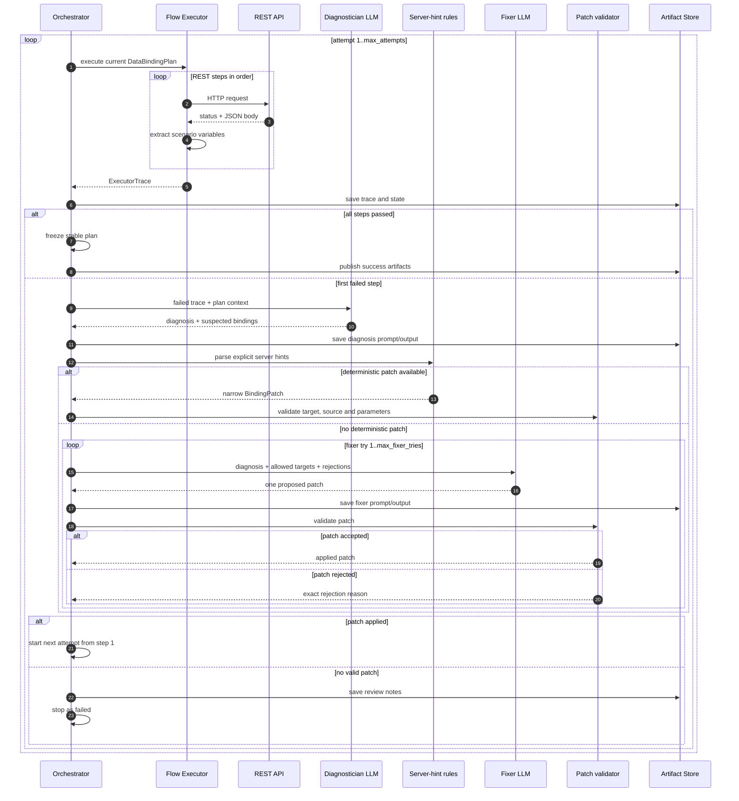
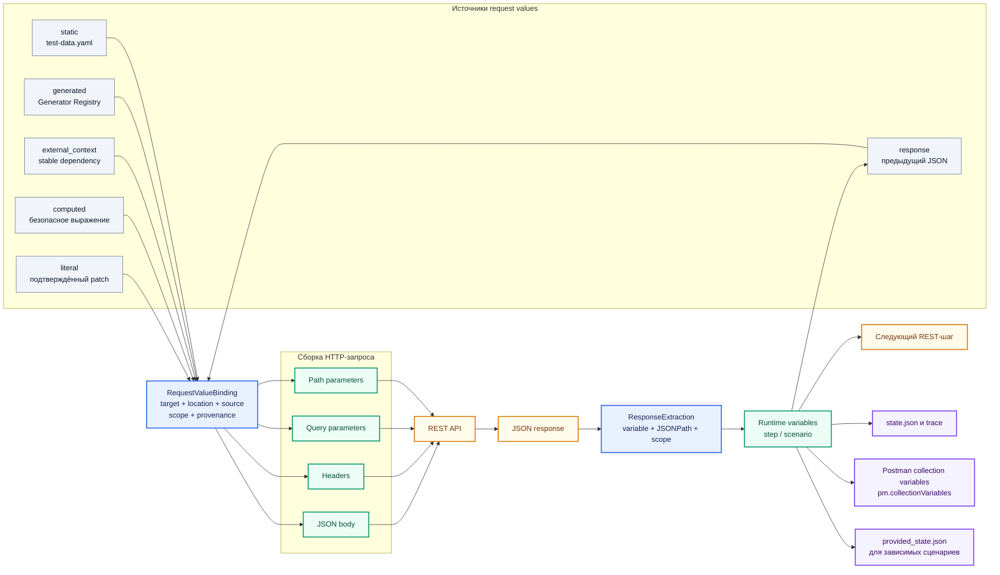
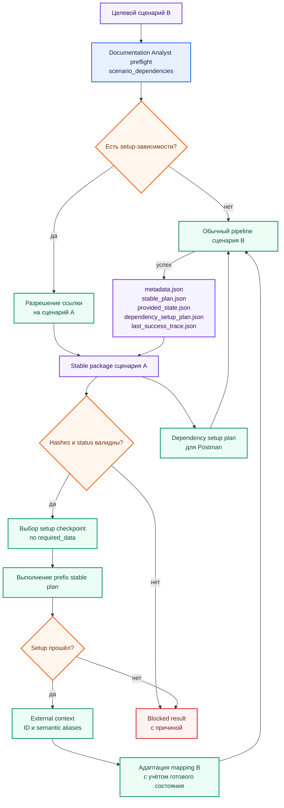
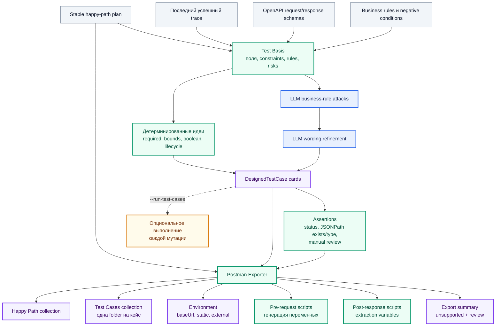

# Демонстрационные схемы TestDesignerAI

Комплект отражает фактическую архитектуру текущей реализации. Синим обозначены
решения LLM-агентов, зелёным - детерминированная логика Python, жёлтым -
внешнее исполнение, фиолетовым - сохраняемые результаты.

## 1. Контекст системы

Показывает входы, основные подсистемы и результаты одного запуска.



## 2. Полный агентный pipeline

Система использует LLM для семантических решений, но не позволяет модели
непосредственно управлять HTTP или безусловно изменять план.

```mermaid
flowchart TB
    start(["Запуск сценария"])
    load["Загрузка Markdown, OpenAPI,<br/>test data и external context"]

    subgraph understanding["Понимание сценария"]
        analyst["Documentation Analyst<br/>цель, шаги, правила, зависимости"]
        analyst_contract{"Pydantic validation"}
        mapper["Endpoint Mapper<br/>по одному вызову на business step<br/>все операции: method/path/summary/status"]
        mapping_guard["Проверка method/path,<br/>порядка и дублей"]
    end

    subgraph planning["Планирование данных"]
        graph["Data Dependency Graph<br/>request needs + response producers"]
        resolver["Dependency Resolver<br/>выбор candidate_id"]
        deterministic_sources["Static и external bindings"]
        generation["Generation Binding<br/>выбор генератора или источника"]
        fallback["Безопасные fallback bindings"]
        assembly["Сборка DataBindingPlan"]
        plan_guard{"Проверка каждого binding"}
    end

    subgraph runtime["Исполнение и обучение на ответах API"]
        execute["Flow Executor<br/>последовательные REST-запросы"]
        passed{"Все шаги 2xx?"}
        diagnose["Stabilization Diagnostician"]
        hint["Детерминированный<br/>server-hint parser"]
        fixer["Stabilization Fixer"]
        patch_guard{"Patch validator"}
        patch["Ограниченное изменение<br/>DataBindingPlan"]
    end

    subgraph delivery["Формирование результата"]
        testbasis["Python Test Basis<br/>поля, schemas, правила"]
        attacks["Test Designer<br/>business-rule attacks"]
        cases["Карточки тест-кейсов<br/>assertions + traceability"]
        tcrun["Опциональное HTTP-исполнение<br/>тест-кейсов"]
        export["Postman Exporter"]
        stable["Публикация stable package"]
    end

    finish(["Результат запуска"])
    stop(["Остановка с диагностикой"])

    start --> load --> analyst --> analyst_contract
    analyst_contract -->|валидно| mapper
    analyst_contract -->|ошибка| stop
    mapper --> mapping_guard
    mapping_guard -->|есть операции| graph
    mapping_guard -->|нет операций| stop
    graph --> resolver --> deterministic_sources --> generation --> fallback --> assembly --> plan_guard
    plan_guard -->|валидно| execute
    plan_guard -->|критическая ошибка| stop
    execute --> passed
    passed -->|да| testbasis
    passed -->|нет| diagnose
    diagnose --> hint
    hint -->|патч найден| patch_guard
    hint -->|патча нет| fixer
    fixer --> patch_guard
    patch_guard -->|разрешён| patch --> execute
    patch_guard -->|отклонён, есть try| fixer
    patch_guard -->|исчерпаны try| stop
    testbasis --> attacks --> cases
    cases -. при --run-test-cases .-> tcrun
    cases --> export
    cases --> stable
    tcrun --> finish
    export --> finish
    stable --> finish

    classDef llm fill:#E8F0FE,stroke:#2563EB,color:#172554,stroke-width:2px;
    classDef code fill:#ECFDF5,stroke:#059669,color:#064E3B,stroke-width:2px;
    classDef decision fill:#FFF7ED,stroke:#EA580C,color:#7C2D12,stroke-width:2px;
    classDef output fill:#F5F3FF,stroke:#7C3AED,color:#3B0764,stroke-width:2px;
    classDef terminal fill:#F8FAFC,stroke:#334155,color:#0F172A,stroke-width:2px;
    classDef failed fill:#FEF2F2,stroke:#DC2626,color:#7F1D1D,stroke-width:2px;

    class analyst,mapper,resolver,generation,diagnose,fixer,attacks llm;
    class load,mapping_guard,graph,deterministic_sources,fallback,assembly,execute,hint,patch,testbasis,tcrun,export,stable code;
    class analyst_contract,plan_guard,passed,patch_guard decision;
    class cases output;
    class start,finish terminal;
    class stop failed;
```

## 3. Цикл стабилизации

Это центральный агентный контур: сервер выступает источником наблюдений, а
Diagnostician и Fixer корректируют только проверяемую часть плана.



## 4. Происхождение и движение данных

Схема показывает, как значение попадает в запрос и затем становится переменной
для следующих шагов и Postman.



## 5. Зависимые сценарии и stable packages

Предварительно стабилизированный сценарий может воспроизводимо подготовить
состояние для следующего сценария.



## 6. Формирование карточек и Postman

Один и тот же stable plan является основой как карточек тест-кейсов, так и
исполняемых Postman-артефактов.



## 7. Реальная трасса `demo_01`

Схема построена по запуску от 9 июня 2026 года. Она демонстрирует обнаружение
ошибок данных, применение двух патчей и успешное завершение.

```mermaid
flowchart LR
    input["Scenario 01<br/>Basic economy rental"]
    planning["Анализ и planning<br/>8 REST-шагов"]

    a1["Attempt 1"]
    e1["s02 POST /vehicles/search<br/>pickupDate = returnDate"]
    r1["400 INVALID_DATES"]
    d1["Diagnostician<br/>returnDate must be later"]
    f1["Fixer patch<br/>s02 returnDate: days 1 -> 2"]

    a2["Attempt 2"]
    e2["s07 POST /pickup<br/>fuelLevelPercent != 100"]
    r2["400 FUEL_LEVEL_NOT_FULL"]
    d2["Diagnostician + server hint"]
    f2["Deterministic patch<br/>fuelLevelPercent = 100"]

    a3["Attempt 3"]
    ok["8 из 8 REST-шагов<br/>успешно"]
    design["47 карточек тест-кейсов<br/>execution status: not_run"]
    postman["2 Postman collections<br/>225 test-case requests"]
    stable["Stable package published"]
    review["review_required = true<br/>патчи требуют проверки"]

    input --> planning --> a1 --> e1 --> r1 --> d1 --> f1
    f1 --> a2 --> e2 --> r2 --> d2 --> f2
    f2 --> a3 --> ok
    ok --> design
    ok --> postman
    ok --> stable
    f1 --> review
    f2 --> review

    classDef input fill:#F1F5F9,stroke:#64748B,color:#0F172A;
    classDef code fill:#ECFDF5,stroke:#059669,color:#064E3B,stroke-width:2px;
    classDef failed fill:#FEF2F2,stroke:#DC2626,color:#7F1D1D,stroke-width:2px;
    classDef llm fill:#E8F0FE,stroke:#2563EB,color:#172554,stroke-width:2px;
    classDef patch fill:#FFF7ED,stroke:#EA580C,color:#7C2D12,stroke-width:2px;
    classDef output fill:#F5F3FF,stroke:#7C3AED,color:#3B0764,stroke-width:2px;
    classDef warning fill:#FEFCE8,stroke:#CA8A04,color:#713F12,stroke-width:2px;

    class input input;
    class planning,a1,a2,a3,ok code;
    class e1,r1,e2,r2 failed;
    class d1,d2 llm;
    class f1,f2 patch;
    class design,postman,stable output;
    class review warning;
```



## Рекомендуемый порядок демонстрации

1. Контекст системы: какие входы получает система и что выдаёт.
2. Полный pipeline: где принимает решения LLM, а где работает Python.
3. Цикл стабилизации: как ответы сервера превращаются в корректировки.
4. Движение данных: генерация и извлечение переменных между запросами.
5. Stable dependencies: как сценарии подготавливают состояние друг для друга.
6. Карточки и Postman: два итоговых формата одного плана.
7. `demo_01`: реальный пример прохождения после двух исправлений.

